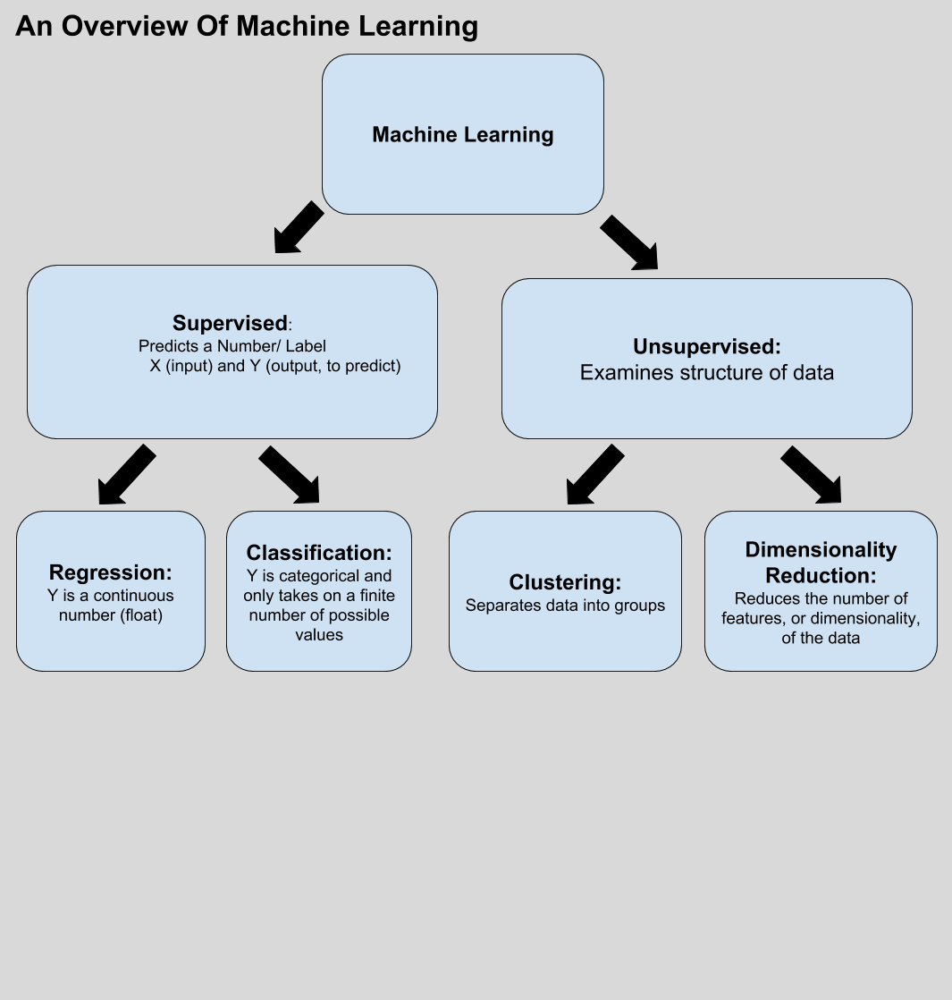

# Zooming Out: An Overview of Machine Learning

Let's take a minute to zoom out and return to the larger picture of machine learning. To date, we've explored two major categories of supervised learning: regression and classification. Regression attempts to predict a continuous numerical value while classification attempts to predict a categorical value that has some limited number of values to take on.

From here, we're about to venture into unsupervised learning. Unsupervised learning is trying to find structure in our data and tell us something new about it, or view it from another perspective. At a high level, this can be broken into two main subcategories: clustering techniques, used to sort data into homogenous groups, and dimensionality reduction techniques which are useful for compression and visualization. 

Here's this as a diagram: 

  

          
While outside the scope of this course, there are an even wider range of machine learning algorithms. For example, here's another infographic regarding machine learning:
  
Take a look at more details here:  
  
http://www.researchinfinitesolutions.com/blog/Machine-learning-Algorithms  
Another useful diagram, which also demonstrates how much there is to learn, is this cheat-sheet from SciKitLearn:

http://scikit-learn.org/stable/tutorial/machine_learning_map/index.html

As you can see, the world of data science and machine learning is vast! There's always more to learn and investigate. With that, take some time to investigate the links above and do a little more research regarding the topic of machine learning, what techniques are used, and what problems it can solve.
